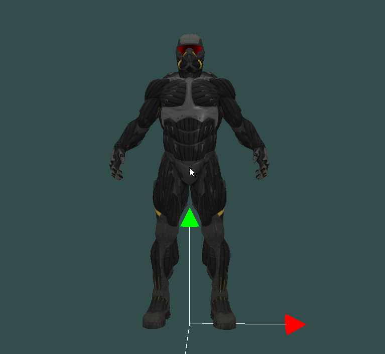

# SceneEditor
场景编辑器-对场景中物体进行动态添加、删除、移动、旋转、缩放，以及地形图、水面的添加

## 编写原因
一开始主要为了将学习到的灯光技术加以应用并能实时调整观察效果以及应用碰撞、射线检测知识。但是基本的实现后准备实现完整的场景编辑器

## 已经实现
- 自动添加球体包围盒
- 射线检测
- 物体可视化平移编辑
- 物体可视化缩放编辑
- 物体可视化旋转编辑
## 待实现
- 完善灯光系统
- 动态添加物体、删除物体
- 实时显示物体组件信息
- 地形图、水面渲染
- 场景管理功能
- 导出场景信息

## 目前效果图

